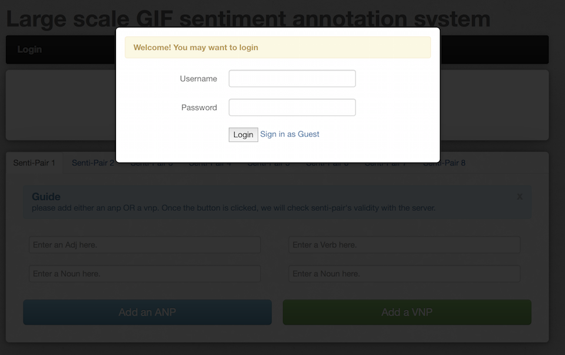
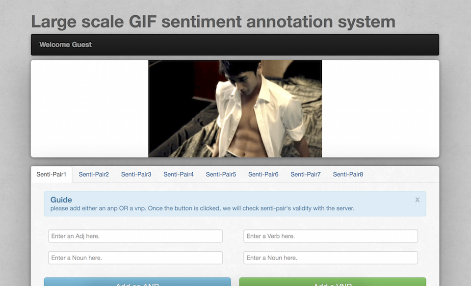

You can make a contribution to GSO-2015 by telling us the SentiPair Sequence and Overall Sentiment of GIF videos in our [Annotation System][1].

The Annotation system comes with a login verification. For anonymous users online, please just click the *Sign in as Guest* link in the login dialog.

Our Annotation System looks like the picture below.

###Step 1: SentiPair Sequence

For a given GIF video, please COMPLETE the SentiPair Sequence in this dialog

Note that in the SentiPair Sequence, each SentiPair is sorted according to their occurence in the original video.

###Step 2: Video Sentiment
Please tell us the GIF video's sentiment by clicking the button in the following panel.

###Step 3: Submit
Click the Submit button and your annotation will be saved immediately. Each GIF video will be sent to three different annotators to ensure the correctness of annotation. Thank you again!

Your annotation is of great help to researchers, how about [**TRY IT OUT?**][1]

[1]: http://zygnote.eicp.net:2288/ProjectAlice