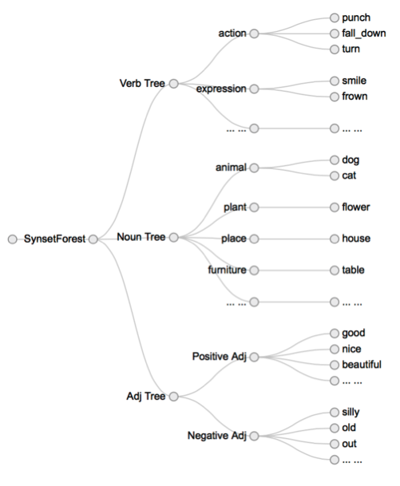
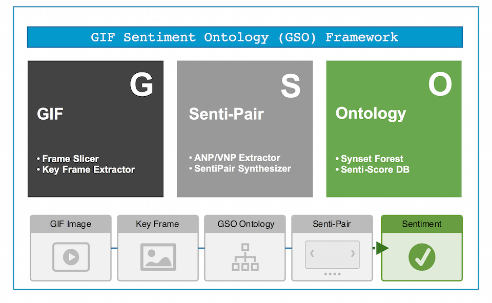

###What is GSO Framework

GSO Framework is ``` a framework to judge GIF video's sentiment.```	It is the first implementation of GIF Sentiment Ontology(GSO). 
It is also the ```first``` framework targeting on the problem of GIF sentiment analysis for social networks. GSO Framework as well as the GSO is designed by Cai Zheng during his second year as a graduate student in Xiamen University.

---
###Why GSO Framework
Industries deviate from user habit by taking social network sentiment analysis as social network text analysis. Research for GIF sentiment analysis is still in its infancy.

The problem of GIF sentiment analysis is quite challenging, not only because it hinges on spatio-temporal visual content abstraction, but also because the relationship between such abstraction and final sentiment remains unknown. But we look from another angle. By generating a collection of mid-level representations, modeling the relationship between SentiPair and sentiment, and opening the first procedure to other fast-developing research fields (video classification, et al.), we made the impossible possible.


###SentiPair Sequence
When considering the problem of GIF sentiment analysis, we should firstly figure out a way to represent our research target—GIF video. A good representation should follow several criterions:

1. **Descriptive**: to describe the abstract information 
2. **Detective**: to be detected
3. **Easy**: to model the abstractions easily.
4. **Flexible**: able to be extended.





To resolve these criterions, we introduced the SentiPair Sequence. **A SentiPair Sequence is a sequence of SentiPairs, while the SentiPair is the joint name of Adjective Noun Pair (ANP) and Verb Noun Pair (VNP)**. In a SentiPair Sequence, each SentiPair refers to a concrete concept like “smile face” or “falling cup”, and SentiPairs are placed in the order of their occurrence.


As we can see, the girl in the video acts differently. At the very first, The girl is smiling and hence the first SentiPair indicates “Lovely Girl”, In the next frame, the girl looked a bit worried, and the second SentiPair is “Innocent Girl”, With the third SentiPair indicates “Girl Frown”, we can find out that the girl looks sad, which contains a negative sentiment tendency. In the last frame, the girl failed to suppress her feeling.


###Synset Forest
SentiPairs are built on three kinds of words: adjectives, verbs and nouns. In order to build ANP/VNP, we should first build the collection of words to choose from. We concluded some criterions for a good word collection.

1. Coverage, a good word collection should cover as much domains as possible in order to convey the information
2. Discrepancy, words of similar meanings should appear only once to prevent ambiguous ANP/VNP.
3. Sentiment relation, all the words in the collection should have a clear sentiment relation.

We introduced **Synset Forest** to resolve these three criterions. The Synset Forest is a forest consists of three trees, namely adjective tree, verb tree and the noun tree.

In the Wordnet, Synsets are interlinked by means of conceptual-semantic and lexical relations. By proposing the Synset Forest, we modeled a unified semantic and concept architecture. The Synset Forest acts as a collection of candidate words for Adjective Noun Pairs and Verb Noun Pairs. Since each node comes with a sentiment score, the weight for each ANP/VNP is decided at the first place.

###Performance
We designed two experiments. The first experiment is designed to evaluate the performance of SentiPair Sequences we proposed. Different models applied and the evaluation metric is the accuracy. Moreover, we explored the possibility to simplify the problem by introducing feature selection.
The second experiment is designed to compare the performance of our framework to the state-of-the-art representation VSO (Borth et al. 2013). The evaluation metric is the accuracy as well.
We choose to use the GSO-2015 dataset to train the sentiment classifiers. One of the advantages of GSO is its ability to convey temporal information (through SentiPair Combination). The training set consists of 1124 positive instances (60.3%), 146 negative instances (7.8%) and 599 neutral ones (32.1%).

###GSO-2015 Dataset
We built a new GIF video dataset from one of the most popular micro-blog provider. All the GIF videos were posted by online users and were collected automatically. We built 40,000+ distinct candidates. These candidates were then manually labeled in the fashion of GIF Sentiment Ontology. This work is possible owing to the crowd intelligence. We recruited 7 workers. Each worker was shown one GIF video and was expected to accomplish two "tasks". "Task 1" is to depict the given GIF using SentiPair Sequence. To be more specific, for each GIF, SentiPairs were chosen by the worker. And each SentiPair consists either of an adjective and a noun (ANP) or a verb and a noun (VNP). Figure 4 illustrates the flow of SentiPairs and the corresponding GIF. In "Task 2" workers were expected to give the image an overall sentiment judgment (Positive/Negative/Neutral/Can't Judge).


